# Payphone Digital Gateway

 

The **Payphone Digital Gateway** is a high-performance, configuration-driven API Gateway designed to unify access to Payphone's microservices. It handles routing, protocol translation (HTTP to gRPC), dynamic validation, authentication, and traffic control.

## 🏗️ Architecture Overview

The Gateway acts as the single entry point for all client applications (Web, Mobile, 3rd Party), protecting internal services and standardizing API access.

```mermaid
graph TD
    Client[📱/💻 Client Apps] -->|HTTPS| Gateway[🛡️ Gateway Service]
    
    subgraph "Infrastructure"
        Gateway -->|Read Config| DB[(🐘 PostgreSQL)]
        Gateway -->|Rate Limit/Cache| Redis[(🔴 Redis)]
    end
    
    subgraph "Internal Services"
        Gateway -->|HTTP/gRPC| Auth[🔐 Auth Service]
        Gateway -->|HTTP/gRPC| Core[💸 Core Service]
        Gateway -->|HTTP| Payment[💳 Payment Service]
        Gateway -->|HTTP| Report[📊 Report Service]
    end
```



## 🔄 Request Processing Flow

Every incoming request passes through a strict middleware pipeline before reaching any upstream service.

```mermaid
flowchart TD
    Req[Incoming Request] --> RateLimit{⏱️ Rate Limit Check}
    
    RateLimit -- Exceeded --> 429[Return 429 Too Many Requests]
    RateLimit -- OK --> Auth{🔐 Auth Check}
    
    Auth -- Invalid Token --> 401[Return 401 Unauthorized]
    Auth -- OK --> Router[📍 Dynamic Router]
    
    Router -- No Route --> 404[Return 404 Not Found]
    Router --> ExtractVars[📥 Extract Variables\n(Path/Query/Body)]
    
    ExtractVars --> Validation{🛡️ Dynamic Validation}
    
    Validation -- Invalid Data --> 400[Return 400 Bad Request]
    Validation -- OK --> CircuitBreaker{⚡ Circuit Breaker}
    
    CircuitBreaker -- Open --> 503[Return 503 Service Unavailable]
    CircuitBreaker -- Closed --> Protocol{Protocol?}
    
    Protocol -- HTTP --> HttpProxy[🌐 HTTP Proxy]
    Protocol -- gRPC --> GrpcProxy[🔌 gRPC Proxy]
    
    HttpProxy --> Upstream[Upstream Service]
    GrpcProxy --> Upstream
    
    Upstream --> ResponseProc[📤 Response Processing]
    ResponseProc --> Client[Return Response to Client]
```

## 🚀 Key Capabilities

### 1. Dynamic Routing & Variable Injection
Configure routes at runtime without code changes. The gateway extracts variables from the incoming request and injects them into the target path.
- **Source**: Request Path (`/users/{id}`), Query Params, Headers, Body JSON.
- **Target**: Upstream Path (`/api/v1/internal/users/{id}`), Headers, Body.

### 2. The Validation Engine (`dynamic_validation.go`)
Before a request hits your backend, the gateway strictly validates the payload based on JSON configuration.
- **Supported Types**: `string`, `number`, `integer`, `boolean`, `array`, `object`, `date`.
- **Validation Rules**:
  | Rule | Description | Example |
  |------|-------------|---------|
  | `required` | Field must be present | `true` |
  | `min` / `max` | Min/Max value (number) or length (string) | `10` |
  | `email` | Standard email format | `true` |
  | `regex` / `pattern` | Custom regex validation | `^user_\d+$` |
  | `enum` | Value must be in allowed list | `["active", "inactive"]` |
  | `uuid` | Must be valid UUID v4 | `true` |
  | `date` | Must be ISO8601/RFC3339 | `true` |
  | `ip` | Must be valid IPv4/IPv6 | `true` |

### 3. Protocol Translation (gRPC)
The gateway can accept JSON HTTP requests and transcode them into Protobuf messages for gRPC upstreams dynamically using `jhump/protoreflect`.
- **Method Discovery**: Dynamically finds gRPC methods.
- **Transcoding**: JSON <-> Protobuf automatic conversion.

### 4. Resiliency Patterns
- **Distributed Rate Limiting**: Token bucket algorithm using Redis to prevent abuse.
- **Circuit Breaker**: Detects upstream failures and fails fast to prevent cascading system failure.
- **Retries**: Configurable retry policies (count, backoff) for idempotent requests.

## ⚙️ Configuration (.env)

| Variable | Description | Default |
|----------|-------------|---------|
| `APP_PORT` | Port to run the gateway | `8080` |
| `DB_HOST` | PostgreSQL Host | `localhost` |
| `REDIS_HOST` | Redis Host | `localhost` |
| `JWT_SECRET` | Secret key for JWT verification | - |
| `RATE_LIMIT_MAX_REQUEST` | Max requests per duration | `100` |
| `RATE_LIMIT_DURATION` | Duration window in seconds | `60` |

## 📦 Database Schema (`integrasi_url_configs`)

The core routing logic is driven by the `integrasi_url_configs` table.

```json
// Example 'variables' JSONB structure
{
  "user_id": {
    "data_type": "string",
    "is_required": true,
    "validations": {
      "uuid": true
    },
    "value": "{{request.body.user_id}}" // Dynamic extraction
  }
}
```

## 🛠️ Development Setup

1. **Clone & Setup**
   ```bash
   git clone https://github.com/Payphone-Digital/gateway.git
   cd gateway
   cp .env.example .env
   go mod download
   ```

2. **Run Locally**
   ```bash
   go run cmd/main.go
   ```

3. **Running Tests**
   ```bash
   go test ./...
   ```

## 🤝 Contribution
1. Create a feature branch.
2. Implement changes in `internal/` or `pkg/`.
3. Ensure all new middleware includes unit tests.
4. Submit a Pull Request.

---
© 2024 Payphone Digital. All Rights Reserved.
